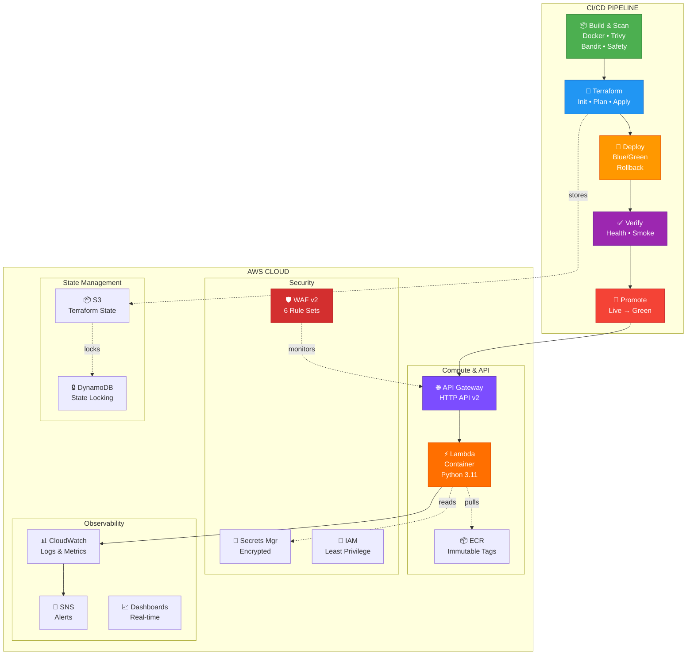
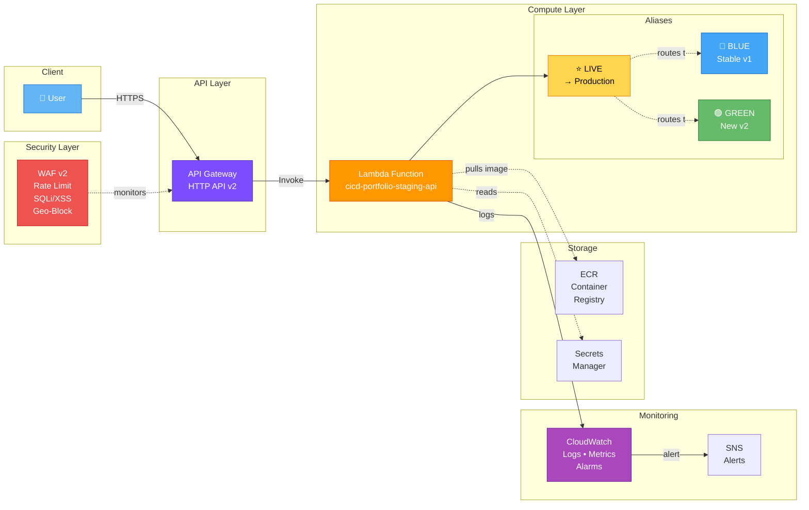
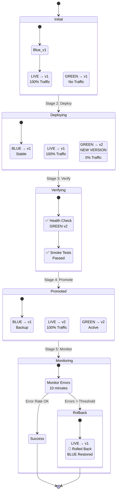
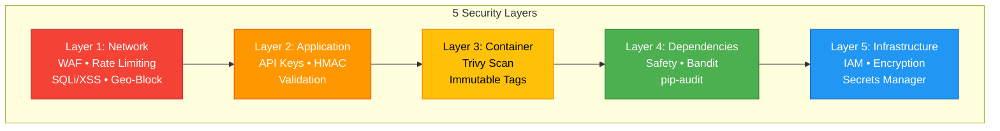
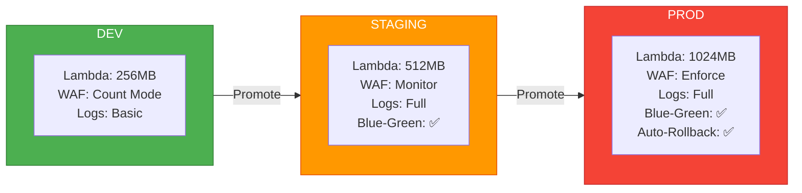

# Production CI/CD Pipeline Architecture

> **Zero-touch deployment • Infrastructure as Code • Blue-Green Strategy**

---

## 🎨 Visual Architecture Diagram

---

## 🏗️ Complete Infrastructure

---

## 🔄 Blue-Green Deployment Flow

---

## 🛡️ Security Layers

---

## 📊 Multi-Environment Architecture

---

## 📈 Key Metrics

| Metric | Value | Description |
|--------|-------|-------------|
| **Deploy Time** | <2m | Infrastructure + Code Deployment |
| **Monthly Cost** | $0 | Free tier (Lambda, API GW, CloudWatch) |
| **Manual Steps** | 0 | Fully automated pipeline |
| **Test Coverage** | 85% | Authentication & Core Logic |
| **Security Layers** | 5 | Network → Infrastructure |
| **Environments** | 3 | Dev, Staging, Production |
| **AWS Services** | 12 | Lambda, API GW, ECR, WAF, etc. |
| **Zero-Downtime** | ✅ | Blue-Green Deployment |

---

## 🎯 Quick Reference

### AWS Services Used
- **Compute**: Lambda (Python 3.11, Containerized)
- **API**: API Gateway HTTP API (v2)
- **Storage**: ECR (Container Registry), S3 (State)
- **Security**: WAF v2, Secrets Manager, IAM
- **Monitoring**: CloudWatch Logs/Metrics, SNS, X-Ray
- **Orchestration**: EventBridge
- **State**: DynamoDB (Locking)

### CI/CD Pipeline
- **Source**: GitHub
- **CI/CD**: GitHub Actions (6 stages)
- **Security**: Trivy, Safety, Bandit
- **Testing**: pytest (85% coverage), Locust
- **IaC**: Terraform 1.6

### Security Features
- ✅ WAF with 6 rule sets (2000 req/5min per IP)
- ✅ API Key + HMAC authentication
- ✅ Container scanning (Trivy)
- ✅ Dependency scanning (Safety, Bandit)
- ✅ Immutable container tags
- ✅ Encrypted secrets (Secrets Manager)
- ✅ IAM least privilege

### Deployment Features
- ✅ Blue-Green deployment
- ✅ Automated rollback (on errors)
- ✅ Health checks + smoke tests
- ✅ Zero-downtime deployments
- ✅ Multi-environment (dev/staging/prod)
- ✅ Terraform state management (S3 + DynamoDB)

---

## 🔗 Related Documentation

- [Complete Architecture Details](./ARCHITECTURE-DIAGRAM.md)
- [Error Log & Solutions](./ERROR-LOG.md)
- [Alignment Analysis](./ALIGNMENT-WITH-ARCHITECTURE.md)
- [Testing Summary](./TESTING-SUMMARY.md)

---

**Status**: ✅ Infrastructure Deployed | 🔄 Pipeline Testing
**Last Updated**: 2026-01-19
**Author**: Your Name
**Project**: Production CI/CD Portfolio
